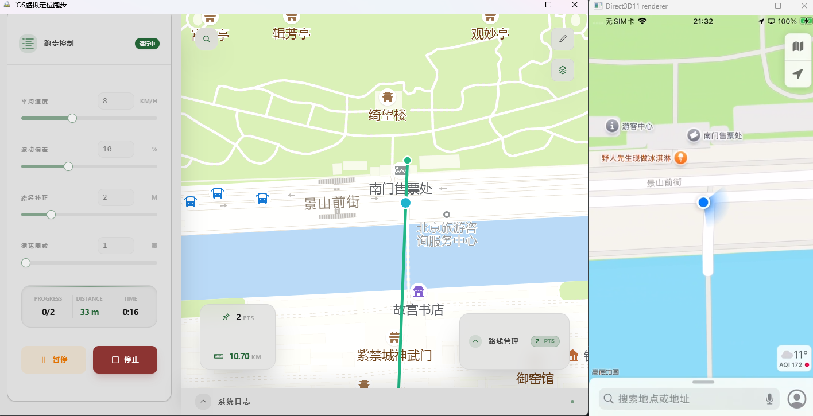
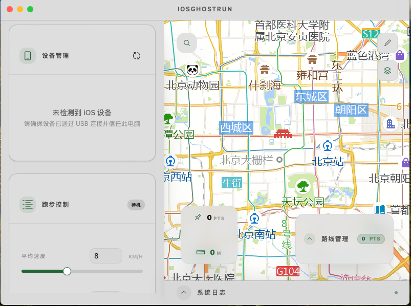

# iOSGhostRun - iOS 虚拟跑步

基于 go-ios 和 Wails 开发的跨平台 iOS 虚拟定位跑步打卡应用。

## 功能特性

-   **虚拟跑步模拟**: 模拟真实跑步轨迹，支持设置跑步速度
-   **随机化支持**: 支持速度随机波动和路线随机偏移，模拟真实跑步
-   **路线规划**: 支持在地图上手动绘制路线，自动保存上次路线
-   **设备管理**: 自动检测并连接 iOS 设备
-   **跨平台**: 支持 Windows、macOS、Linux

## 截图

### Windows



### macOS



## 安装与运行

### 环境要求

-   Go 1.21+
-   Node.js 18+
-   Wails CLI v2

### 快速开始

```bash
# 安装依赖
go install github.com/wailsapp/wails/v2/cmd/wails@latest
cd frontend && npm install && cd ..
go mod tidy

# 开发运行
wails dev

# 构建发布
wails build -platform windows/amd64      # Windows
wails build -platform darwin/universal   # macOS
wails build -platform linux/amd64        # Linux
```

> **iOS 17+ 说明**: 要在 Windows 上运行此功能，请从 `https://git.zx2c4.com/wintun` 下载最新的 wintun.dll 并将其复制到 `C:/Windows/system32`

## 使用步骤

1. **连接设备**: USB 连接 iOS 设备并在设备上信任此电脑，点击应用中的"刷新"
2. **绘制路线**: 点击地图 D 按钮进入绘制模式，在地图上添加至少 2 个路线点（自动保存）
3. **配置参数**: 设置跑步速度、速度波动、路线偏移和循环次数
4. **开始跑步**: 点击"开始跑步"，可随时暂停/继续/停止，完成后点击"重置真实位置"

## 测试环境

| 平台    | 操作系统   |                |
| ------- | ---------- | -------------- |
| Windows | Windows 11 | AMD64          |
| macOS   | macOS 15.7 | x64            |
| iOS     | iOS 16.1   | iPhone 12 mini |

## 技术栈

-   **后端**: Go + go-ios
-   **前端**: Vue 3 + Leaflet
-   **框架**: Wails v2

## 许可证与免责声明

MIT License

**免责声明**: 本软件仅供学习研究使用，请自行承担使用风险。
