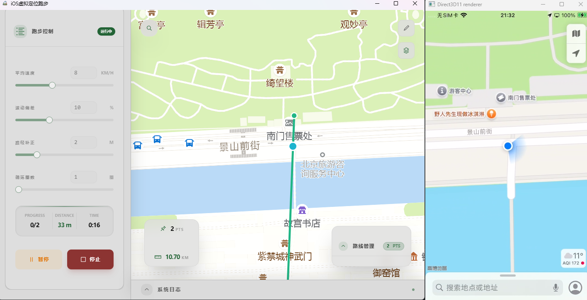
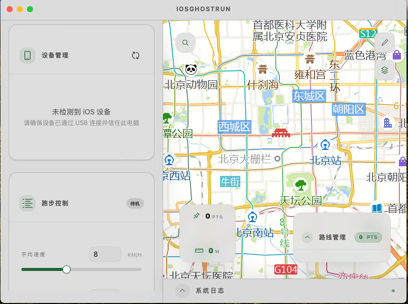

# iOSGhostRun - iOS 虚拟跑步

基于 [go-ios](https://github.com/danielpaulus/go-ios) 和 [Wails v3](https://v3.wails.io/) 开发的跨平台 iOS 虚拟跑步应用。

## 功能特性

- **虚拟跑步模拟**: 按设定速度推进定位点，模拟连续运动。
- **随机化支持**: 支持速度波动和路线偏移，模拟真实跑步。
- **地图路线编辑**: 支持手动绘制路线、搜索地点、自动保存路线。
- **实时位置可视化**: 跑步过程实时显示当前位置与轨迹。
- **设备管理**: 自动检测并连接 iOS 设备，支持任意 iOS 版本。
- **跨平台桌面端**: 支持 Windows、macOS、Linux。

> **iOS 17+ 说明**: 要在 Windows 上运行此功能，请根据自己的架构从 `assets/wintun/{arm|x86|x64}/wintun.dll` 中选取对应版本的 wintun.dll 并复制到 `C:/Windows/system32`

## 截图





## 安装与运行

### 环境要求

- [Golang](https://go.dev) 1.25+
- [Bun](https://bun.sh/)
- [Wails v3](https://v3.wails.io/getting-started/installation/)

### 快速开始

```bash
# 安装依赖
cd frontend && bun install && cd ..
go mod tidy

# 开发运行
wails3 dev

# 构建发布
wails3 build   # 仅build当前架构，带 Console
wails3 package # 打包所有架构，不带 Console
```

## 使用步骤

1. 连接设备: USB 连接 iOS 设备，并在设备上选择信任此电脑。
2. 刷新设备: 在应用内点击刷新，确认设备已识别。
3. 绘制路线: 进入绘制模式，添加至少 2 个路线点。
4. 配置参数: 设置速度、速度波动、偏移和循环次数。
5. 开始跑步: 点击开始，可暂停/继续/停止，结束后重置真实位置。

## 测试环境

| 平台    | 系统版本   | 设备/架构      |
| ------- | ---------- | -------------- |
| Windows | Windows 11 | x64            |
| macOS   | macOS 15.7 | x64            |
| iOS     | iOS 16.1   | iPhone 12 mini |
| iOS     | iOS 26.0.1 | iPhone SE 2020 |

## 许可证与免责声明

[MIT License](LICENSE)

**免责声明**：本软件仅供学习和研究使用，请自行承担使用风险。
